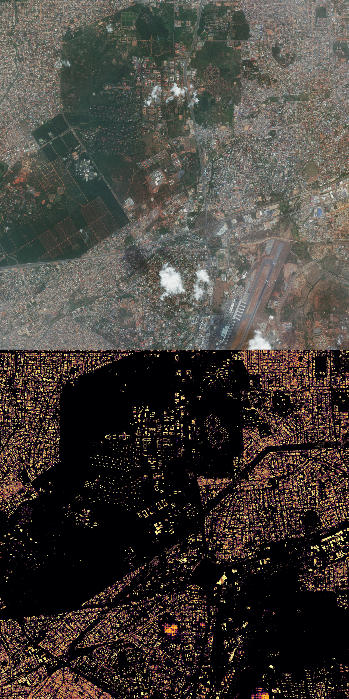
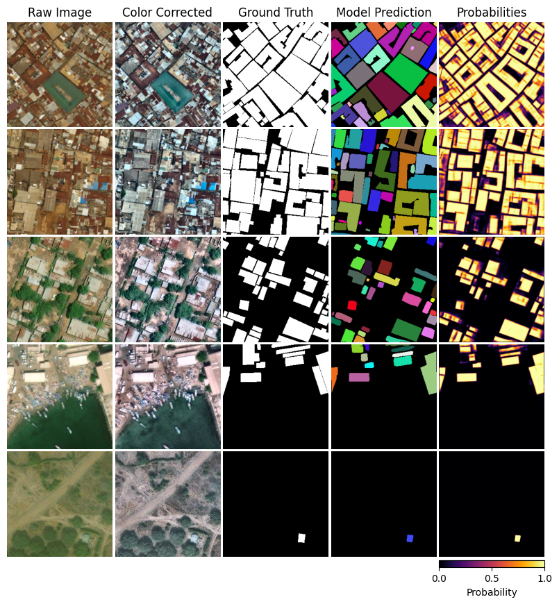
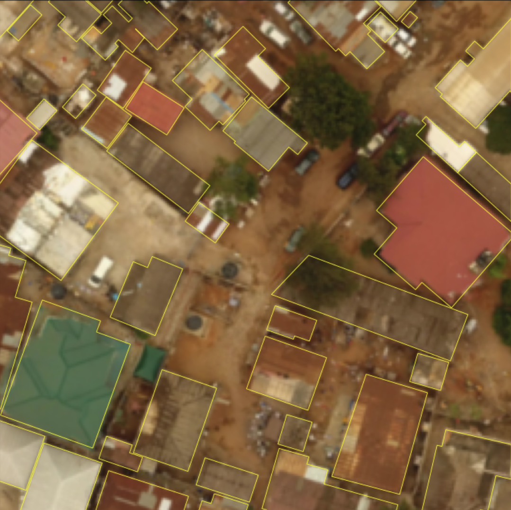

# SMART SAMPLING

Repository for training a segmentation model on satellite / aerial images as part of the surveillance of antimalarial resistance in Ghana II initiative. This is a collaborative partnership between the [Bernhard Nocht Institute for Tropical Medicine](https://www.bnitm.de/en) (Hamburg, Germany) and the [Kumasi Center for Collaborative Research](https://kccr-ghana.org) (Kumasi, Ghana). Data in the target region is graciously provided by the [European Space Agency](https://www.esa.int/).
  

The project seeks to improve malaria prevalence estimates in rural Western Africa by combining remote sensing–driven household mapping with comprehensive parasite detection. This repository is a placeholder until the code for model development is made public. This code enables the development and evaluation of an instance segmentation pipeline that identifies and draws polygons of individual buildings from high resolution satellite and aerial imagery, for the purposes of household mapping. 




---
# Quick start

Base installation:

``` bash
  pyenv local 3.13.7
  python -m venv .venv
  source .venv/Scripts/activate
  python -m pip install --upgrade pip
  pip install -e .
```

Note: By default the installation does not include hardware acceleration support. You will need to manually install the right version of pytorch to go along with your version of CUDA. For example, this repository was created with CUDA Version: 12.6. The correct installation of torch was done with:

```
pip install torch torchvision torchaudio --index-url https://download.pytorch.org/whl/cu124
```

See [here](https://pytorch.org/get-started/previous-versions/) if you are running a different version of CUDA. 

You can (optionally) configure your root directory by specifying a full absolute file path in an environment file. Create a file called `.env` with the contents:
```
SS_ROOT='/path/to/root/directory/
```

Place this file in the root directory for it to take effect. This is only necessary in case the root directory is not already set automatically, such as within a Docker container.

--- 

# Notebooks

This repository comes with a number of notebooks to document steps, from loading the data to training a model and making new predictions. The notebooks are structured as follows:

| Notebook | Description |
| :--- | :--- |
| [0_ramp_intro_and_pull_data.ipynb](notebooks/0_ramp_intro_and_pull_data.ipynb) | General introduction and data download instructions. |
| [1_ramp_raw_data_check.ipynb](notebooks/1_ramp_raw_data_check.ipynb) | Initial inspection of random images and footprint overlays. |
| [2_ramp_color_contrast_correction.ipynb](notebooks/2_ramp_color_contrast_correction.ipynb) | Demonstration of color correction and CLAHE preprocessing. |
| [3_ramp_augmentation_plots.ipynb](notebooks/3_ramp_augmentation_plots.ipynb) | Visualization of image augmentation techniques used for training. |
| [4_ramp_data_loader.ipynb](notebooks/4_ramp_data_loader.ipynb) | Explanation of data loading and file matching logic. |
| [5_ramp_train_test_split.ipynb](notebooks/5_ramp_train_test_split.ipynb) | Illustration of the spatial train/val/test splitting strategy. |
| [6a_ramp_unet_model_encoder.ipynb](notebooks/6a_ramp_unet_model_encoder.ipynb) | Deep dive into the ConvNeXt encoder architecture. |
| [6b_ramp_unet_model_decoder.ipynb](notebooks/6b_ramp_unet_model_decoder.ipynb) | Deep dive into the U-Net decoder and skip connections. |
| [7_ramp_model_training.ipynb](notebooks/7_ramp_model_training.ipynb) | Setup and execution of the model training pipeline. |
| [8_ramp_post_processing.ipynb](notebooks/8_ramp_post_processing.ipynb) | Post-processing steps: probability maps to instance polygons. |
| [9_ramp_model_evaluation.ipynb](notebooks/9_ramp_model_evaluation.ipynb) | Evaluating the model, and making predictions for new data. |
| [10_ramp_end_to_end.ipynb](notebooks/10_ramp_end_to_end.ipynb) | Syntax examples for full end-to-end model training, evaluation and prediction. |
--- 

# Winning Model Performance

### Model ID
- 20260202-151141

### Semantic segmentation metrics on the test set:
- Accuracy: 0.941
- Balanced Accuracy: 0.863
- Precision: 0.768
- Recall: 0.759

### Instance segmentation metrics on the test set:
- mAP@0.5IoU: 0.610
- Accuracy: 0.504
- Precision: 0.639
- Recall: 0.705

### Example segmentations:



### Notes on winning model architecture and training:

- Design: **U-net architecture**

```
ENCODER (ConvNeXt)                                   DECODER (Upsampling)
==================                                   ====================

Input [x] (H x W) -------------------> Skip --------------> Up_Out (H x W) --> Head --> Output
       |                                                     ^          (1x1 Conv)
       |                                                     |
       |                                                    Up0 (H/2 x W/2) 
       |                                                     ^
       v                                                     |
Stage 1: f1 (H/4 x W/4) -------------> Skip --------------> Up1 (H/4 x W/4)
       |                                                     ^
       v                                                     |
Stage 2: f2 (H/8 x W/8) -------------> Skip --------------> Up2 (H/8 x W/8)
       |                                                     ^
       v                                                     |
Stage 3: f3 (H/16 x W/16) -----------> Skip --------------> Up3 (H/16 x W/16)
       |                                                     ^
       v                                                     |
Stage 4: f4 (H/32 x W/32) ------- [Bottleneck] --------------/
```

- ConvNeXt Large backbone (via the timm library). The backbone extracts feature maps at four different scales (strides of 4, 8, 16, and 32), initialized with pretrained ImageNet weights.
- Decoder: The decoder progressively upsamples the features back to the original image resolution. It uses standard skip connections from the encoder for the lower resolutions. Notably, the final upsampling layer differs from a standard U-Net; it receives the original input image as a skip connection to help refine the final full-resolution output. This is because ConvNeXt applies a patching step in its stem layer that down-samples the input directly to stride 4. 
- Output: A final 1x1 convolution layer projects the upsampled features to the desired number of classes (in this case 1, just building instances).

**Training**:

- The primary script for training is [Train.py](./scripts/train.py). This trains a base model on the RAMP dataset (see below).
- The primary script for finetuning is [Finetune.py](./scripts/finetune.py). This adapts the base model and trains it further on proprietary data from the European Space Agency.
- Pipeline Configuration: The process is governed by a PipelineConfig object that centralizes all settings, including data paths, spatial splitting strategies (e.g., training splits by geographical location), and hyperparameters.
- Data processing steps: the fllowing techniques are applied in training: Color Correction, Contrast Enhancement (CLAHE), and mask erosion.
- Training Strategy: Training is conducted in two phases. 1) The model is initialized with random skip and decoder weights. The encoder is initialized with ImageNet pre-trained weights, and subsequently frozen. The decoder and skip connections are trained with an adaptive learning rate. 2) In the second phase the full model is unfrozen and trained with a lower learning rate.
- Finetuning is conducted in one phase with a fully unfrozen model and an even lower learning rate.
- Loss Calculation: Training/finetuing use a composite loss function (The linear combination of weighted binary cross-entropy and focal tversky loss.). The weighting of cross-entropy is done with pixel-wise weights that up-weight parts of the image near building boundaries. Pixel weights are normalized on a per-batch basis to ensure images that contain few buildings don't under-weight areas with no buildings. 
- Optimization: A ReduceLROnPlateau scheduler lowerers the learning rate if validation performance stalls.
- Training Monitoring: The pipeline automatically tracks the best validation
loss, saves model checkpoints and logs, and identifies the best-performing model file at the end.

---
# Data

Two data sources are used:

**RAMP**

This dataset comprises a set of images + labels from the [replicable AI for microplanning](https://staging.source.coop/ramp/ramp) initiative. You can view the images [here](https://map.openaerialmap.org/#/-0.12462615966796874,5.675775839406891,12?_k=2dpmkv). The data are high quality aerial images and corresponding building outlines.

An example image and its corresponding labels:



 

**ESA**

The European Space Agency has kindly provided recent imagery from the Pléiades satellite constellation, specifcially in the target region. 

---
#  Project structure:

```
smart_sampling/
│
├── notebooks/                   # Tutorial notebooks
│   ├── 0_ramp_intro_and_pull_data.ipynb       # Quick into and data downloading
│   ├── 1_ramp_raw_data_check.ipynb            # Basic plotting syntax
│   ├── 2_ramp_color_contrast_correction.ipynb # Image preprocessing
│   ├── 3_ramp_augmentation_plots.ipynb        # Augmentation
│   ├── 4_ramp_data_loader.ipynb               # Data loader classes
│   ├── 5_ramp_train_test_split.ipynb          # Data splitting
│   ├── 6a_ramp_unet_model_encoder.ipynb       # Encoder overview
│   ├── 6b_ramp_unet_model_decoder.ipynb       # Decoder overview
│   ├── 7_ramp_model_training.ipynb            # How to train a model
│   ├── 8_ramp_post_processing.ipynb           # How to go from raw model output to building instances
│   ├── 9_ramp_model_evaluation.ipynb          # Running model eval and inference
│   └── 10_ramp_end_to_end.ipynb               # Full example, start to finish
│
├── data/                        # Data folder (created with ramp_loader.py + external)
│   ├── raw/                
│   │   ├── ramp/                # Datasets for RAMP project
│   │   │   ├── imagery/         # Raw satellite images
│   │   │   │   ├── ramp_accra_ghana/
│   │   │   │   ├── ramp_barishal_bangladesh/
│   │   │   │   └── ...          # Other locations
│   │   │   └── labels/          # Annotations for imagery
│   │   │       ├── ramp_accra_ghana/
│   │   │       ├── ramp_barishal_bangladesh/
│   │   │       └── ...          # Other locations
│   │   ├── esa/                 # Datasets for ESA project
│   │   │   ├── imagery/         # Raw imagery
│   │   │   └── labels/          # Label storage
│   │   │       ├── automatic/   # Model-generated labels
│   │   │       └── manual/      # Hand-labeled annotations
│   │   └── ...                  # Other datasets
│   ├── unprocessed/             # Storage for imagery as supplied by airbus
│   │   └── esa/
│   │       └── location_name/   # e.g. adinkrakrom
│   │           ├── IMG_PHR1A... # Raw image folder
│   │           ├── MASKS/       # QC masks
│   │           └── ...          # Metadata files
│   ├── qgis/                    # QGIS project files and layers
│   │   └── location_name/       # e.g. train_0
│   │       ├── labels.geojson   # Vector labels
│   │       ├── train_0.gpkg     # GeoPackage data
│   │       └── ... .qgz         # QGIS project file
│   ├── pre_processed/           # Intermediate processed data
│   │   └── esa/
│   │       └── location_name/
│   │           └── combined_rgb.tif # Mosaicked/Corrected RGB image
│   ├── pre_inference/           # Data prepared specifically for inference
│   │   └── esa/
│   │       └── location_name/
│   │           ├── pass_0/      # TTA pass 0
│   │           │   ├── tile_0_0.tif
│   │           │   └── ...
│   │           └── pass_n/      # Other TTA passes
│   └── inference/               # Model inference outputs
│       └── esa/
│           ├── tiles/           # Predictions per tile
│           │   └── model_id/
│           │       └── location_name/
│           │           └── pass_0/
│           └── merged/          # Reconstructed full-image predictions
│               └── model_id/
│                   └── location_name/
│                       └── predictions.tif
│
├── models/                      # Folder that contains fitted models (not on github)
│   ├── 20251029-104529/         # Model ID (date-time of fit start)                
│   │   ├── checkpoints/
│   │   │   ├── epoch_001.pt     # Model file after fitting epoch 1   
│   │   │   └── ...              # Other epochs
│   │   ├── model_final.pt       # The model after the final epoch
│   │   └── best.pt              # The model with the lowest validation loss 
│   └── ...                      # Other models
│
├── logs/                        # Folder that contains fit logs (not on github)
│   ├── 20251029-104529/         # Model ID (date-time of fit start)                
│   │   ├── splits/              # Lists of files for training / testing / validation
│   │   │       ├── test_images.txt
│   │   │       ├── test_labels.txt
│   │   │       ├── train_images.txt
│   │   │       ├── train_labels.txt
│   │   │       ├── val_images.txt
│   │   │       └── val_labels.txt
│   │   ├── loss_history.csv     # Loss per training epoch
│   │   ├── settings.txt         # Settings / hyper parameters for this model
│   │   ├── train_semantic_metrics.json        # Metric outputs from evaluation on training set
│   │   ├── train_instance_aggregate_metrics.json
│   │   ├── train_instance_map_metrics.json
│   │   └── ...                  # Similar metrics for val/test sets
│   ├── ...                      # Other models
│   └── training_time.csv        # Tracks cumulative training time across fits
│
├── scripts/                     # High-level scripts to run training, evaluation, and plotting
│   ├── train.py                 # Main training script
│   ├── evaluate.py              # Main evaluation script
│   └── load_model_and_plot.py   # Script to plot some example segmentations
│
├── src/smart_sampling            # Main source code for model fitting and evaluation
│   ├── data/
│   │   ├── ramp/
│   │   │   ├── loading.py       # Functions for handling parallel S3 bucket download
│   │   │   └── ramp_loader.py   # Classes for downloading RAMP datasets
│   │   ├── loaders.py           # Dataloaders -> implement preprocessing / augmentation
│   │   ├── augmentations.py     # Data augmentation (random crop, flip, etc.)
│   │   ├── erosion.py           # Functions for reducing (and expanding) footprints
│   │   ├── cleaning.py          # Image preprocessing functions (color and contrast)
│   │   ├── pixel_weighting.py   # Functions for generating boundary weights
│   │   └── splits.py            # Train / validation / test splitting
│   ├── utils/
│   │   ├── loading.py           # Simple image / label loading functions
│   │   ├── model_vis.py         # Functions for plotting feature maps / kernels
│   │   ├── logger.py            # Class to log training time / model performance
│   │   └── paths.py             # Utilities to set directory structures
│   ├── models/
│   │   ├── base.py              # Base classes for segmentation models
│   │   ├── unet_convnext.py     # U-net with convnext backbone
│   │   └── unet_resnet50.py     # U-net with resnet50 backbone
│   ├── post/
│   │   ├── threshold_masking.py           # Turns probabilities into binary / instance masks
│   │   ├── polygonal_approximation.py     # Cleans up instance masks, and filters small buildings
│   │   └── watershed.py                   # Functionality for post-processing with watershed
│   ├── training/
│   │   ├── loss.py              # Loss functions
│   │   ├── pipeline.py          # Class for end-to-end training pipeline
│   │   └── training.py          # Functionality to core to training of a model 
│   └── evaluation/
│       ├── evaluation.py        # Class for model evaluation
│       ├── instance_metrics_aggregate.py  # Aggregate metrics for instance segmentation
│       ├── instance_metrics_map.py        # COCO metrics for instance segmentation
│       └── semantic_metrics.py            # Metrics for semantic segmentation
│
├── src/smart_sampling_data       # Code for handling data supplied through ESA
│   ├── inference/
│   │   ├── tta_inference.py              # Test Time Augmentation inference loops
│   │   ├── tta_instance_processing.py    # Processing instances from TTA output
│   │   ├── tta_post.py                   # Post-processing TTA predictions
│   │   └── tta_reconstruction.py         # Reconstructing full images from TTA tiles
│   └── preprocessing/
│       ├── preprocess_esa_imagery.py     # Preparing ESA imagery for model consumption
│       ├── preprocess_esa_imagery_tta.py # TTA-specific preprocessing for ESA imagery
│       └── preprocess_esa_labels.py      # Handling and formatting ESA labels
│
├── tests/                       # Unit tests
│   ├── utils.py                 # Utilities for running unit tests
│   ├── run_tests.py             # Script for running all unit tests           
│   ├── test_ewsplitter.py   
│   ├── test_building_dataset_class.py   
│   ├── test_labels_to_mask_and_boundary.py
│   ├── test_load_img_3ch.py
│   ├── test_loss.py
│   ├── test_model_unetconvnext.py
│   ├── test_model_unetresnet50.py
│   ├── test_rasterize_instances.py
│   └── test_training_functions.py
│
├── public/
│   ├── image.png                  # A picture of a cat
│   ├── example.png                # An example image for this readme file
│   ├── model_predictions_plot.png # Some examples of model performance
│   └── unet.png                   # An overview of a U-net model
│
├── .env                         # A file where you can set the project root 
├── requirements.txt             # Full list of dependencies
├── pyproject.toml               # Installation file for the python packages 
├── README.md                    # You're reading this file
└── .gitignore                   # Ignore data folder / standard python files, etc
```
